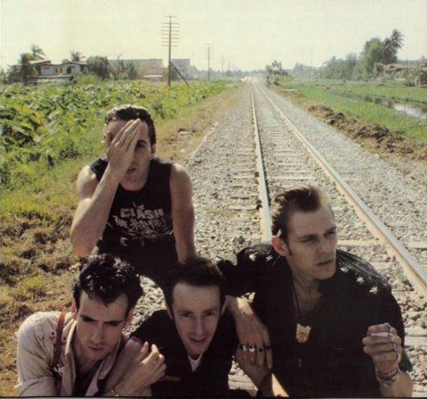

#  [No more] double trouble

Handle duplicate Datomic transactions with ease.
A modified compare-and-swap (cas) function that handles duplicates. On-prem.

## Installation

[](https://clojars.org/com.github.ivarref/double-trouble)

## 2-minute example

```clojure
(require '[com.github.ivarref.double-trouble :as dt])
(require '[datomic.api :as d])

(def conn (let [uri (str "datomic:mem://README-example")]
            (d/delete-database uri)
            (d/create-database uri)
            (d/connect uri)))

; Setup:
@(d/transact conn dt/schema)

(def example-schema
  [#:db{:ident :e/id, :cardinality :db.cardinality/one, :valueType :db.type/string :unique :db.unique/identity}
   #:db{:ident :e/version, :cardinality :db.cardinality/one, :valueType :db.type/long}
   #:db{:ident :e/info, :cardinality :db.cardinality/one, :valueType :db.type/string}])
@(d/transact conn example-schema)

; Add sample data:
@(d/transact conn [{:e/id "my-id" :e/version 1 :e/info "Initial version"}])

; Sample payload:
(def payload {:e/id "my-id"
              :e/info "Second version"
              :e/version 1})

; Initial commit using :dt/cas is fine:
@(dt/transact conn [(dissoc payload :e/version)
                    [:dt/cas [:e/id "my-id"] :e/version 1 2 (dt/sha payload)]])
; => {:db-before datomic.db.Db@a108c315
;     :db-after datomic.db.Db@260c18eb
;     :transacted? true}
; Notice the key :transacted? with value true

; Transacting one more time is also fine:
@(dt/transact conn [(dissoc payload :e/version)
                    [:dt/cas [:e/id "my-id"] :e/version 1 2 (dt/sha payload)]])
; => {:db-before datomic.db.Db@d06fccb2
;     :db-after datomic.db.Db@d06fccb1
;     :transacted? false}
; Notice the key :transacted? with value false

; Why did the above succeed?
; :dt/cas detected that
; :e/version 1 -> 2 had already been asserted in a previous transaction and
; that the sha asserted in that previous transaction matched the sha
; in the current transaction.
; Thus this is a duplicate transaction that should be allowed.
; :dt/cas throws an exception indicating this.

; dt/transact, yes, that is com.github.ivarref.double-trouble/transact,
; catches this particular exception, and returns a result as if the
; transaction had succeeded: a map with the keys :db-before, :db-after and
; :transacted? (false).
```

## Motivation

> The network is reliable

*The first assertion of [fallacies of distributed computing](https://en.wikipedia.org/wiki/Fallacies_of_distributed_computing).*

`:db/cas`, compare-and-swap, can be used as a lock/protection
if you want to disallow concurrent edits on some entity.
Imagine the following scenario where a network failure
occurs after a transaction has successfully completed:

```
1. The client sends HTTP request to Clojure backend.
2. Backend issues @(d/transact ... [[:db/cas [...] :e/version 1 2]]) to the Datomic transactor.
3. The transactor writes successfully to the storage, e.g. PostgreSQL.
; Everything fine so far.

4. The network between the Clojure backend and the Datomic transactor goes down.
5. The invocation of d/transact throws an exception, and the backend returns HTTP status code 500.
6. The network between the Clojure backend and the Datomic transactor comes back up.

; Now what?

7. The client retries the HTTP request.
8. Backend issues an identical @(d/transact ...).
9. Now d/transact throws a cas exception.
10. Backend returns what?

; The client is now stuck.
; What should it do?
```

The aim of this library is to handle such scenarios.

Had `:dt/cas`, and not `:db/cas`, been used, the retry would have
been successful.

## Usage

`:dt/cas` takes 5 arguments, one more than `:db/cas`:
1. The entity id or lookup ref.
2. The attribute to change.
3. The old value.
4. The new value.
5. The sha representing the essence of the transaction.

The first four arguments are identical to Datomic's cas.

The last argument, the sha, should represent the essence of the transaction. 
It will be used to check if the transaction has already been committed in
the event of a cas failure, i.e. if this transaction has a duplicate.

You may use `(dt/sha my-data)` to generate a sha. `my-data` must obviously
be identical for transactions that should be considered identical.
`dt/sha` converts maps and sets into their sorted forms before
calculating the sha.

You may use `com.github.ivarref.double-trouble/transact` to transact data
containing `:dt/cas`. It will catch exceptions, return success in the
case of a duplicate transaction, or re-throw other exceptions.
It will also resolve tempids on the input tx-data:

```clojure
(require '[com.github.ivarref.double-trouble :as dt])

(let [{:keys [transacted? db-after]} @(dt/transact conn [[:dt/cas e attr old-val new-val sha]])]
  (if transacted?
    (log/info "transacted data")
    (log/info "duplicate transaction is fine"))
  (d/pull db-after [:*] lookup-ref))
```

If you prefer handling the exception yourself, you may do it as the following:
```clojure
(require '[com.github.ivarref.double-trouble :as dt])
(require '[datomic.api :as d])

(try
  @(d/transact conn ...)
  (catch Exception e
    (if (dt/already-transacted? e)
      :ok
      '...handle-exception...)))
```

## Example usage in the case of a HTTP backend

```clojure
(try
  (let [{:keys [transacted? db-after]} @(dt/transact conn ...)]
    {:status (if transacted? 201 200) :body (d/pull db-after [:*] lookup-ref)})
  (catch Exception e
    (if (dt/cas-failure? e :e/version)
      {:status 409 :body {:message "Conflict" :expected (dt/expected-val e) :given (dt/given-val e)}}
      {:status 500 :body {:message "Internal server error"}})))
```
The code is simplified, but illustrates the gist of a typical endpoint.
You'll want to handle:
* Actual executed transaction: response code 201.
* Duplicate transaction: response code 200.
* Cas error: response code 409.
* Other errors: response code 500.


## Error handling and health checking

If there is a regular cas mismatch and thus an actual conflict, `:dt/cas`
will throw an exception identical to the one thrown by `:db/cas`.
Thus if you are already catching this kind of exception, you may keep
using that code.

If there is an older duplicate transaction, e.g. cas from version 1 to 2
with a previously asserted and correct sha,
but the current version now being at 3 (and not 2), `double-trouble` considers
this an error. In this case `double-trouble` will also throw a regular `:db/cas` exception.
This most likely means that the client/issuer of the transaction is out of sync, and
thus you will want it to fail.

If `com.github.ivarref.double-trouble/transact` detects a duplicate sha
for a non-duplicate transaction, it will reset the atom
`com.github.ivarref.double-trouble/healthy?` to `false`.
You may monitor this atom in a healthcheck. It defaults to `true`.

If a duplicate sha occurs, your code is most likely broken (or a sha collision
has occurred). It could also be that `double trouble`'s logic failed in some
unforeseen way, and thus did in fact introduce additional trouble ¯\\\_(ツ)\_/¯.

## FAQ

> Can I use shas for versioning?

Yes.

> Where is the sha asserted? 

The sha is asserted on the transaction metadata attribute `:com.github.ivarref.double-trouble/sha-1`.

## Limitations

`com.github.ivarref.double-trouble/transact` does not return
`tempids` nor `tx-data` for duplicate transactions. For regular
transactions it removes those keys so that you do not mistakenly
rely on them when using this library.

## Alternatives and related software

I did not find any similar libraries for Datomic.

[toxiproxy](https://github.com/Shopify/toxiproxy), a TCP proxy to simulate network and system conditions for chaos
and resiliency testing, as well as [clj-test-containers](https://github.com/javahippie/clj-test-containers)
and/or [testcontainers-java](https://github.com/testcontainers/testcontainers-java) is worth checking out.

I've also written [mikkmokk-proxy](https://github.com/ivarref/mikkmokk-proxy), an HTTP reverse proxy
for doing fault injection on the HTTP layer, as well as [yoltq](https://github.com/ivarref/yoltq), a
persistent Datomic queue for building (more) reliable systems.

## Changelog

#### 2022-06-20 v0.1.92
Allow `cas-failure?` to work on a single exception and no attribute.

#### 2022-06-17 v0.1.89
First publicly announced release.

## License

Copyright © 2022 Ivar Refsdal

This program and the accompanying materials are made available under the terms of the Eclipse Public License 2.0 which is available at http://www.eclipse.org/legal/epl-2.0.

This Source Code may also be made available under the following Secondary Licenses when the conditions for such availability set forth in the Eclipse Public License, v. 2.0 are satisfied: GNU General Public License as published by the Free Software Foundation, either version 2 of the License, or (at your option) any later version, with the GNU Classpath Exception which is available at https://www.gnu.org/software/classpath/license.html.
